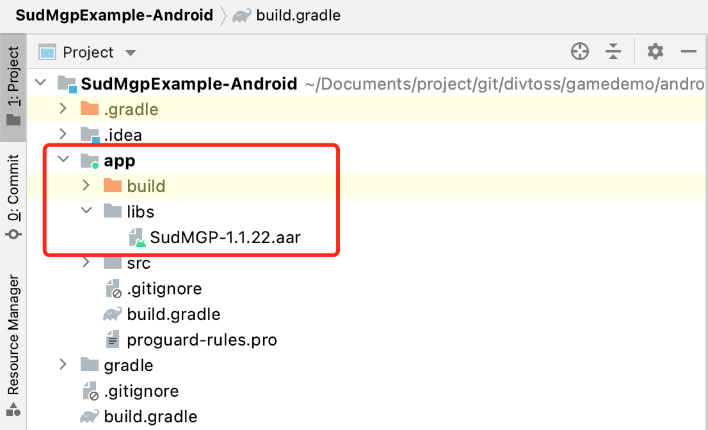

#


## Android 快速开始

1. 需要联系Sud.Tech为业务分配 `appId`、 `appKey`、 `appSecret`

2. 联系获取Android SDK `SudMGP.aar` 和 Demo工程 `HelloSud-Android.zip`

3. 在工程中引入SDK：

    以Android Studio 4.2，Gradle 6.7.1，编程语言Java，工程SudMgpExample-Android为例：

    - 将 `SudMGPSDK.aar` 拷贝到SudMgpExample-Android/app/libs目录

        如下图：

        

    - 编辑SudMgpExample-Android/app/build.gradle，增加SDK需要的配置

        ```groovy
        android {
        ......
            // 游戏SDK使用了viewBinding
            buildFeatures {
                viewBinding true
            }
        }
        
        repositories {
            // 加载游戏SDK libs路径
            flatDir {
                dirs '../app/libs'
            }
        }
        dependencies {
        // 加载游戏SDK aar
            implementation fileTree(include: ['*.jar', "*.aar"], dir: 'libs')
            // 游戏SDK需引入glide库
            implementation 'com.github.bumptech.glide:glide:4.12.0'
        
            ......
        }
        ```

4. 初始化 [SudMGP](./API/SudMGP.md) ，具体可参考HelloSud-Android

5. 对接 [SudMGP](./API/SudMGP.md) 相关生命周期回调，讲游戏View加入到原生布局中，具体可参考HelloSud-Android

6. 通过 [SudMGP](API/SudMGP.md) 加载小游戏，具体可参考HelloSud-Android

7. 可选：实现 [ISudFSMMG](API/ISudFSMMG.md) ，具体可参考HelloSud-Android

8. 可选：实现 [ISudFSTAPP](API/ISudFSTAPP.md) ，具体可参考HelloSud-Android

9. 反初始化 [SudMGP](API/SudMGP.md) ，具体可参考HelloSud-Android
