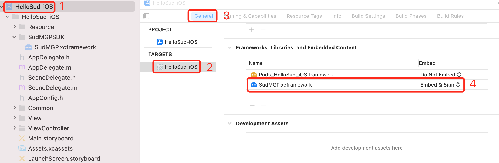

#


## iOS快速开始

1. 需要联系Sud.Tech为业务分配 `appId`、 `appKey`、 `appSecret`

2. 联系获取iOS SDK `SudMGP.framework`、`lib_runtime.framework` 和 Demo工程 `HelloSud-iOS.zip`

3. 在工程中引入SDK：

    以Xcode 13.0，编程语言Objective-C，目标工程SudMgpExample-iOS为例：

    - 将`SudMGP.framework`、 `lib_runtime.framework` 拷贝到GameSDK文件夹中

    - 打开Xcode，选择TARGETS，选中SudMgpExample-iOS，选中Build Settings，搜索Enable Bitcode，配置为No

    - 在TARGETS中，选中SudMgpExample-iOS，选择 Build Phases

    - 将 `lib_runtime.framework`、`SudMGP.framework` 拖到 Link Binary With Libraries

    - 选择 General，在 Frameworks, Libraries, and Embedded Content 中，将 `SudMGP.framework`、`lib_runtime.framework` 设置为 Embed & Sign

        如下图：

        

        

        

4. 编辑SudMgpExample-iOS/info.plist增加蓝牙权限（后续此权限会想办法去掉）

    ```xml
    <plist version="1.0">
            <dict>
                ......
                <key>NSBluetoothAlwaysUsageDescription</key>
                <string>是否允许“SudMgpExample-iOS”使用您的蓝牙，以便使用蓝牙设备，用于xxxxx</string>
                <key>NSBluetoothPeripheralUsageDescription</key>
                <string>是否允许“SudMgpExample-iOS”使用您的外接设备，以便使用外接设备，用于xxxxx</string>
                <key>NSLocationWhenInUseUsageDescription</key>
                <string>我们需要通过您的地理位置信息获取您周边的相关数据，用于xxxxx</string>
            </dict>
    </plist>
    ```

5. 如果项目使用CocoaPods，则编辑项目的Podfile，引用SudMGP所需第三方库，编辑如下：

    ```ruby
        # SudMGP
        pod 'Masonry'
        pod 'AFNetworking'
        pod 'SDWebImage'
    ```

   然后执行pod install下载依赖库。

   如下图：

   

   如果项目未使用CocoaPods，则可查看 [CocoaPods集成方法](https://cocoapods.org)

6. 初始化 [SudMGP](./API/SudMGP.md) ，具体可参考HelloSud-iOS

7. 通过 [SudMGP](API/SudMGP.md) 加载小游戏，具体可参考HelloSud-iOS

8. 可选：实现 [ISudFSMMG](API/ISudFSMMG.md) 响应MG状态机，具体可参考HelloSud-iOS

9. 可选：实现 [ISudFSTAPP](API/ISudFSTAPP.md) 将App状态发送到App状态控制器，具体可参考HelloSud-iOS

10. 反初始化 [SudMGP](API/SudMGP.md) ，具体可参考HelloSud-iOS
