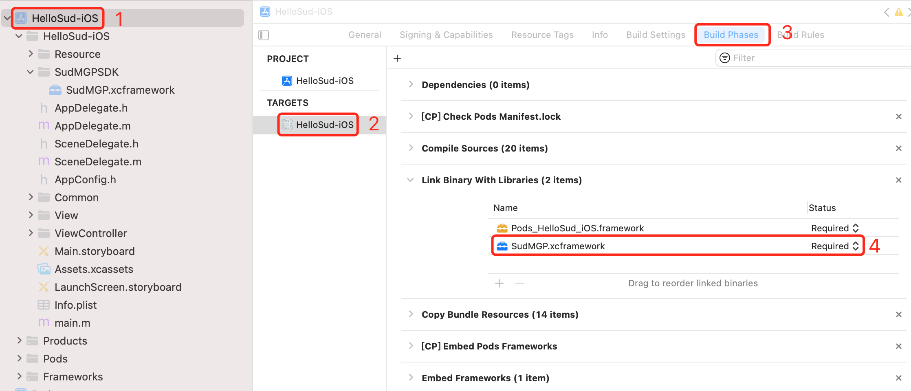
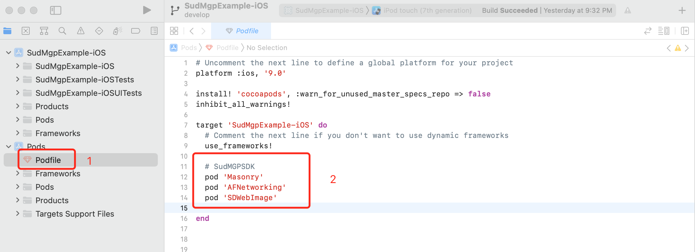

[Toc]

# SudMGP SDK

更新时间 2021/10/19 10:00:00


## 平台要求

| 平台    | 支持版本     |
| ------- | ------------ |
| Android | Android 5.0+ |
| iOS     | iOS 9.0+     |


## 快速开始

### Android接入流程

1. 与Sud商务团队洽谈合作事宜，获取项目的appid、appkey、appsecret、code和SudMGPSDK库链接等信息

2. 从SudMGPSDK库链接下载SudMGPSDK.aar

3. 在工程中引入SDK：

   以Android Studio 4.2，Gradle 6.7.1，工程SudMgpExample-Android为例：

   - 将SudMGPSDK.aar拷贝到SudMgpExample-Android/app/libs目录

     如下图：

     

   - 编辑SudMgpExample-Android/app/build.gradle，增加SDK需要的配置

     ```groovy
     android {
       	......
         // 游戏SDK使用了viewBinding
         buildFeatures {
             viewBinding true
         }
     }
     
     repositories {
         // 加载游戏SDK路径
         flatDir {
             dirs '../app/libs'
         }
     }
     dependencies {
       	// 加载游戏SDK aar
         implementation fileTree(include: ['*.jar', "*.aar"], dir: 'libs')
         // 游戏SDK需引入glide库
         implementation 'com.github.bumptech.glide:glide:4.12.0'
     
     		......
     }
     ```

4. 新建注册GameActivity用于展示游戏界面

5. 在游戏列表入口界面跳转游戏界面GameActivity

   ```java
   	public static final int GAME_ID_BUMPER_CAR = 1001; // 游戏ID:碰碰车
   	public static final int GAME_ID_FLY_CUTTER = 1002; // 游戏ID:飞刀达人
   	public static final int GAME_ID_DRAW_GUESS = 1003; // 游戏ID:你画我猜
   	/**
     	* 打开-碰碰车游戏
     	*/
       public void startBumperCar(View view) {
           Intent intent = new Intent(this, GameActivity.class);
           intent.putExtra(GameActivity.KEY_GAME_ID, GAME_ID_BUMPER_CAR);
           startActivity(intent);
       }
   
       /**
        * 打开-飞刀达人游戏
        */
       public void startFlyCutter(View view) {
           Intent intent = new Intent(this, GameActivity.class);
           intent.putExtra(GameActivity.KEY_GAME_ID, GAME_ID_FLY_CUTTER);
           startActivity(intent);
       }
   
       /**
        * 打开-你画我猜游戏
        */
       public void startDrawGuess(View view) {
           Intent intent = new Intent(this, GameActivity.class);
           intent.putExtra(GameActivity.KEY_GAME_ID, GAME_ID_DRAW_GUESS);
           startActivity(intent);
       }
   
   
   ```

6. GameActivity初始化游戏SDK，加载游戏 并把游戏view加入项目界面

   ```java
       /**
        * 1，初始化游戏SDK
        *
        * @param context   上下文
        * @param appID     appID
        * @param appKey    appKey
        * @param isTestEnv 是否是测试环境，true：测试环境，false：正式环境
        */
       private void initGameSDK(Context context, String appID, String appKey, Boolean isTestEnv) {
           SudMGP.initSDK(context, appID, appKey, isTestEnv, new ISudListenerInitSDK() {
               @Override
               public void onSuccess() {
                   showToast("初始化游戏SDK成功");
                   loadMG(GameActivity.this, mUserID, mRoomID, CODE, mGameId, mLanguage);
               }
   
               @Override
               public void onFailure(int code, String errInfo) {
                   showToast("初始化游戏SDK失败:" + code + "--errInfo:" + errInfo);
               }
           });
       }
   
       /**
        * 2，加载游戏
        *
        * @param activity 上下文Activity
        * @param userID   用户ID，业务系统保证每个用户拥有唯一ID
        * @param roomID   房间ID，进入同一房间内的
        * @param code     令牌
        * @param gameID   游戏ID
        * @param language 游戏语言 现支持，简体：zh-CN 繁体：zh-TW 英语：en-US 马来语：ms-MY
        */
       private void loadMG(Activity activity, String userID, String roomID, String code, int gameID, String language) {
           mISudFSTAPP = SudMGP.loadMG(activity, userID, roomID, code, gameID, language, mISudFSMMG);
           addGameView(mISudFSTAPP.getGameView());
       }
   
       /**
        * 3，将游戏view添加到我们的布局当中
        *
        * @param gameView
        */
       private void addGameView(View gameView) {
           FrameLayout container = findViewById(R.id.game_container);
           container.addView(gameView);
           appStateToMG();
       }
   ```

   

### iOS接入流程

1. 与Sud商务团队洽谈合作事宜，获取项目的appid、appkey、appsecret、code和SudMGPSDK库链接等信息

2. 从SudMGPSDK库链接下载SudMGPSDK.framework和lib_runtime.framework

3. 在工程中引入SDK：

   以Xcode 13.0，目标工程SudMgpExample-iOS为例：

   - 将lib_runtime.framework、SudMGPSDK.framework 拷贝到GameSDK文件夹中

   - 打开Xcode，选择TARGETS，选中SudMgpExample-iOS，选中Build Settings，搜索Enable Bitcode，配置为No

   - 在TARGETS中，选中SudMgpExample-iOS，选择 Build Phases

   - 将 lib_runtime.framework、SudMGPSDK.framework 拖到 Link Binary With Libraries

   - 选择 General，在 Frameworks, Libraries, and Embedded Content 中，将

     lib_runtime.framework、SudMGPSDK.framework设置为 Embed & Sign

     如下图：

     

     

   

   

4. 如果项目使用CocoaPods，则编辑项目的Podfile，引用SDK所需第三方库，编辑如下：

   ```ruby
     # SudMGPSDK
     pod 'Masonry'
     pod 'AFNetworking', '~> 4.0'
     pod 'Toast', '~> 4.0.0'
     pod 'SDWebImage'
     pod 'XLForm', '~> 4.3'
     pod 'HXPhotoPicker/SDWebImage', '~> 3.2.1'
   ```

   然后执行pod install下载依赖库。

   如下图：

   

   如果项目未使用CocoaPods，则可查看 [CocoaPods集成方法](https://cocoapods.org)

5. 项目新建两个ViewController,一个为游戏列表GameListViewController，一个为游戏显示GameViewController。如下图：

   

   

6. 在GameListViewController中初始化SDK，代码如下：

   ```objective-c
   #import "GameListViewController.h"
   #import "GameViewController.h"
   #import <SudMGPSDK/SudMGP.h>
   
   /**
    * 初始化游戏SDK
    *
    * @param appID      NSString        项目的appID
    * @param appKey     NSString        项目的appKey
    * @param isTestEnv  Boolean         是否是测试环境，true:测试环境, false:正式环境
    * @param gameID     NSInteger       游戏ID，如 碰碰我最强:1001；飞刀我最强:1002；你画我猜:1003
    */
   - (void)initGameSDKWithAppID:(NSString *)appID appKey:(NSString *)appKey isTestEnv:(Boolean)isTestEnv gameID:(NSInteger)gameID {
       [SudMGP initSDK:appID appKey:appKey isTestEnv:isTestEnv listener:^(int retCode, const NSString *retMsg) {
           if (retCode == 0) {
               // SudMGPSDK初始化成功,跳转游戏界面
               GameViewController *gameVC = [[GameViewController alloc] init];
               if (@available(iOS 13.0, *)) {
                   gameVC.modalInPresentation = YES;
               }
               gameVC.gameEnum = (int)gameID;
               gameVC.modalPresentationStyle = UIModalPresentationFullScreen;
               [self presentViewController:gameVC animated:YES completion:nil];
           } else {
               /// 初始化失败, 可根据业务重试
               NSLog(@"初始化sdk失败");
           }
       }];
   }
   ```

   

7. 在GameViewController需要实现 ISudFSMMG 代理协议和加载游戏view，销毁GameViewController需要调用destroyMG方法，代码入下所示：

   ```objective-c
   #import "GameViewController.h"
   #import <SudMGPSDK/ISudFSMMG.h>
   #import <SudMGPSDK/ISudFSTAPP.h>
   #import <SudMGPSDK/SudMGP.h>
   #import <SudMGPSDK/ISudFSMStateHandle.h>
   
   @interface GameViewController () <ISudFSMMG>
   @property (nonatomic, strong) id<ISudFSTAPP> fsmAPP2MG;
   @end
   
   @implementation GameViewController
   
   - (void)viewDidLoad {
       [super viewDidLoad];
       
       self.view.backgroundColor = [UIColor whiteColor];
       
       /// 加载MG
       NSString *demoCode = @"xxxxxxxxxxxxxxxx";
       [self loadMG:@"xxxxxx" roomId:@"xxx" code:demoCode mgId: xxxxxxx language:@"zh-CN" fsmMG:self rootView:self.view];
   }
   
   /** 加载游戏MG
    *
    * @param userId 用户唯一ID
    * @param roomId 房间ID
    * @param code 游戏登录code
    * @param mgId 游戏ID
    * @param language 支持简体"zh-CN "    繁体"zh-TW"    英语"en-US"   马来"ms-MY"
    * @param fsmMG 控制器
    * @param rootView 游戏根视图
    */
   - (void)loadMG: (NSString *)userId roomId: (NSString *)roomId code: (NSString *)code mgId: (int)mgId language: (NSString *)language fsmMG:(id)fsmMG rootView: (UIView*)rootView {
       self.fsmAPP2MG = [SudMGP loadMG:userId roomId:roomId code:code mgId:mgId language:language fsmMG:fsmMG rootView:rootView];
   }
   
   /// 销毁MG
   - (void)destroyMG {
       [self.fsmAPP2MG destroyMG];
   }
   ```

   

   
