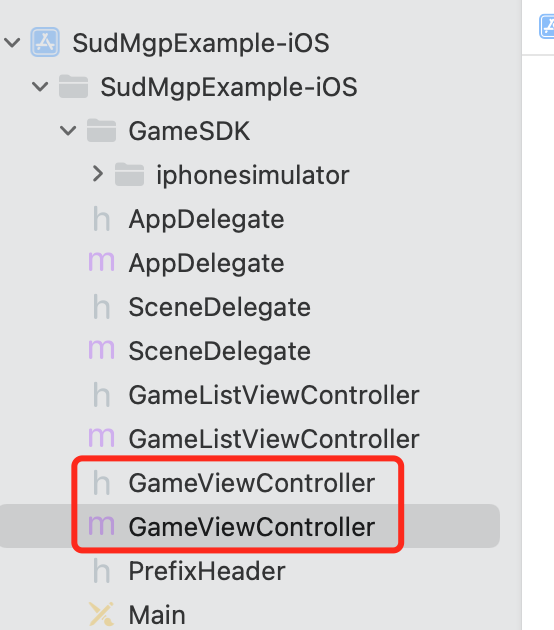

#


[Toc]

# SudMGP SDK

更新时间 2021/10/19 10:00:00


## 产品介绍

**SudMGP SDK** 可以让直播APP实现多人连线玩小游戏的功能，让直播内容更丰富，接入简单便捷，游戏多种多样，适用于各种语音社交APP。


## 支持游戏

| 名称       | 游戏ID | 玩法简介 |
| :--------- | ------ | -------- |
| 碰碰我最强 | 1001   |          |
| 飞刀我最强 | 1002   |          |
| 你画我猜   | 1003   |          |


## 平台要求

| 平台    | 支持版本     |
| ------- | ------------ |
| Android | Android 5.0+ |
| iOS     | iOS 9.0+     |


## 快速开始

### Android接入流程


### iOS接入流程

1. 与Sud商务团队洽谈合作事宜，获取项目的appid、appkey、appsecret、code和SudMGPSDK库链接等信息

2. 从SudMGPSDK库链接下载SudMGPSDK.framework和lib_runtime.framework，两个framework 复制到本项目的 `GameSDK` 文件夹下。

3. 如果项目使用CocoaPods，则编辑项目的Podfile，引用SDK所需第三方库，编辑如下：

   ```ruby
   # SudMGPSDK
   pod 'Masonry'
   pod 'AFNetworking', '~> 4.0'
   pod 'Toast', '~> 4.0.0'
   pod 'SDWebImage'
   pod 'XLForm', '~> 4.3'
   pod 'HXPhotoPicker/SDWebImage', '~> 3.2.1'
   ```

   然后执行pod install下载依赖库。

   如下图：

   

   如果项目未使用CocoaPods，则可查看 [CocoaPods集成方法](https://cocoapods.org)

4. 项目新建两个ViewController,一个为游戏列表GameListViewController，一个为游戏显示GameViewController。如下图：

   

   

5. 在GameListViewController中初始化SDK，代码如下：

   ```objective-c
   /**
    * 初始化游戏SDK
    *
    * @param appID 		NSString		项目的appID
    * @param appKey 		NSString		项目的appKey
    * @param isTestEnv Boolean 		是否是测试环境，true:测试环境, false:正式环境
    * @param gameID 		NSInteger 	游戏ID，如 碰碰我最强:1001；飞刀我最强:1002；你画我猜:1003
    */
   - (void)initGameSDKWithAppID:(NSString *)appID appKey:(NSString *)appKey isTestEnv:(Boolean)isTestEnv gameID:(NSInteger)gameID {
       [SudMGP initSDK:appID appKey:appKey isTestEnv:isTestEnv listener:^(int retCode, const NSString *retMsg) {
           if (retCode == 0) {
               GameViewController *gameVC = [[GameViewController alloc] init];
               if (@available(iOS 13.0, *)) {
                   gameVC.modalInPresentation = YES;
               }
               gameVC.gameEnum = (int)gameID;
               gameVC.modalPresentationStyle = UIModalPresentationFullScreen;
               [self presentViewController:gameVC animated:YES completion:nil];
           } else {
               /// 初始化失败, 可根据业务重试
               NSLog(@"初始化sdk失败");
           }
       }];
   }
   ```

   

6. 在游戏GameViewController中引用

   
