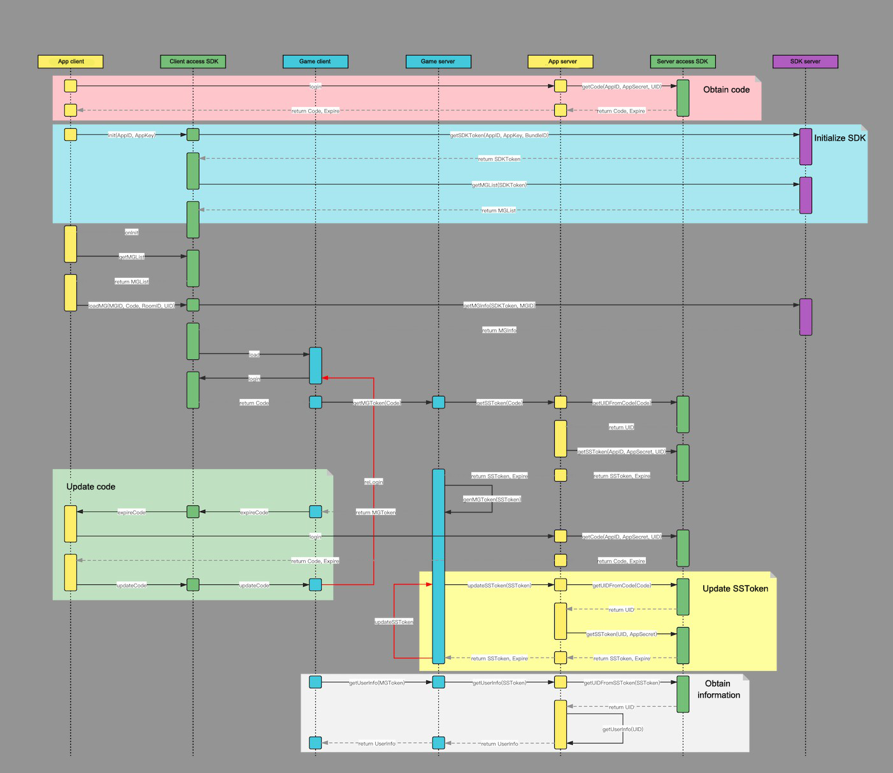

# SudMGP interactive game platform

> Tips
>
> 1. On the client side, the game and the app are mutually finite state machines with no coupling logically.
> 2. The app can selectively respond to the state sent by the game finite state machine `ISudFSMMG`, and make corresponding interactions in the native or do nothing.
> 3. The app can selectively synchronize the app state with the app finite state controller `ISudFSTAPP`, and games can make corresponding feedback and interactive adjustments, or do nothing.
> 4. Since the game server is deployed in the nearest region, if the app is to be launched in multiple regions, it is necessary to generate an app message for each region.

## Quick client access

- [Android](./app/Client/StartUp-Android.md)

- [iOS](./app/Client/StartUp-iOS.md)

## Client documentation

- [Documentation](./app/Client/StartUp.md)

- [Changelog(SudMGP and Game)](./app/Client/ChangeLog.md)
## Download the client SDK

- [SudMGP-Android-v1.1.46.449](https://github.com/SudTechnology/sud-mgp-android/releases/tag/v1.1.46.449)
  
- [SudMGP-iOS-v1.1.46.432](https://github.com/SudTechnology/sud-mgp-ios/releases/tag/v1.1.46.432)
  

## Download the client demo
- [HelloSud-Android-v1.1.46.449](https://github.com/SudTechnology/hello-sud-android/releases/tag/v1.1.46.449)
  
- [HelloSud-iOS-v1.1.46.432](https://github.com/SudTechnology/hello-sud-ios/releases/tag/v1.1.46.432)

## Multiple languages for game
- [Multiple Languages for Game](./app/Client/Languages/README.md) loadMG language parameters

> Tips
>
> 1. On the server side, JWT standard is recommended for the authentication and data exchange between the game server and the app server. Any other customized methods can also be used.
> 2. Call `SudMGPAuth` to implement JWT standard. The app server can retain the original login authentication logic of the client side, and penetrate the login state to the server side, so that the authentication and data exchange between the game server and the app server are all based on the user's login behavior, which maximizes the security of the data. Besides, the app server does not need additional permanent services to deal with complex mapping relations (such as the corresponding relation between the real UID and the virtual UID provided to SudMGP). In theory, only a single point service without storage is required, and the information is actually safely stored in the JWT token.
> 3. Customized methods: The app server can customize the generation and exchange method of any long-term or short-term tokens, without calling `SudMGPAuth`.

## Quick server access

- [Java](./Server/StartUp-Java.md)

- [Go](./Server/StartUp-Go.md)

- [Node](./Server/StartUp-Node.md)

## Server documentation

- [Documentation](./Server/StartUp.md)
- [Changelog](./Server/Server_Change_Log.md)

## Download the server-end SDK

- [Java v1.0.4](https://github.com/SudTechnology/sud-mgp-auth-java/releases)

- [Go v1.0.2](https://github.com/SudTechnology/sud-mgp-auth-go/releases)

- [Node v1.0.1](https://github.com/SudTechnology/sud-mgp-auth-node/releases)

## Download the server-end demo

- [Java v1.0.0](https://github.com/SudTechnology/hello-sud-java/releases)

- [Go v1.0.0](https://github.com/SudTechnology/hello-sud-go/releases)

- [Node v1.0.1](https://github.com/SudTechnology/hello-sud-node/releases)
