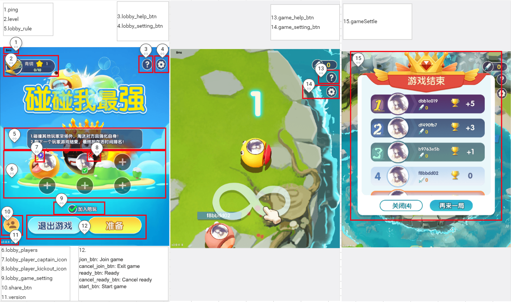

#


```txt
/**
 * Obtain the game Config.
 * @param handle
 * @param dataJson {}
 * Earliest version: V1.1.30.xx.
 */
void onGetGameCfg(ISudFSMStateHandle handle, String dataJson);
```

## Example 
```txt
handle.success(dataJsonResp);

dataJsonResp = {
    "gameMode":1,	// The game mode is set to 1 by default.
	"ui":{
		"gameSettle":{
			"hide":false
		},
		"ping":{
			"hide":false
		},
		"version":{
			"hide":false
		}
	}
}
```

### Annotation


### Parameters

|Parameter|Required|Type|Description|
|:----    |:---|:----- |-----   |
|gameMode	|No	|int	|The game mode. (The parameter is set to **1** by default.)|
|gameCPU	|No	|int	|The CPU power dissipation of the game. Valid values: **0**: normal; **1**: low. The parameter is set to **0** by default.|
|gameSoundControl	|No	|int	|Indicates whether the game plays sound. Valid values: **0**: the game plays sound; **1**: the game does not play sound. The parameter is set to **0** by default.|
|gameSoundVolume	|No	|int	|The volume level of the game. The value ranges from 0 to 100. The parameter is set to **100** by default.|
|ui	|No	|json	|Configuration of the UI. The UI can be customized as displayed or not displayed.|
|ui.gameSettle  |No  |json |The post-game analysis screen.|
|ui.gameSettle.hide  |No  |bool |Indicates whether to hide the post-game screen. Valid values: **false**: show the post-game screen; **true**: hide the post-game screen. The parameter is set to **false** by default.|
|ui.ping  |No  |json |The ping value on the screen.|
|ui.ping.hide  |No  |bool |Indicates whether to hide the ping value. Valid values: **false**: show the ping value; **true**: hide the ping value. The parameter is set to **false** by default.|
|ui.version  |No  |json |The version information on screen.|
|ui.version.hide  |No  |bool |Indicates whether to hide the version information. Valid values: **false**: show the version information; **true**: hide the version information. The parameter is set to **false** by default.|
|ui.level  |No  |json |The ranking tier in the lobby.|
|ui.level.hide  |No  |bool |Indicates whether to hide the ranking tier. Valid values: **false**: show the ranking tier; **true**: hide the ranking tier. The parameter is set to **false** by default.|
|ui.lobby_setting_btn  |No  |json |The **Settings/Sound Effect** button in the lobby.|
|ui.lobby_setting_btn.hide  |No  |bool |Indicates whether to hide the **Settings/Sound Effect** button in the lobby. Valid values: **false**: show the button; **true**: hide the button. The parameter is set to **false** by default.|
|ui.lobby_help_btn  |No  |json |The **Help** button in the lobby.|
|ui.lobby_help_btn.hide  |No  |bool |Indicates whether to hide the **Help** button in the lobby. Valid values: **false**: show the button; **true**: hide the button. The parameter is set to **false** by default.|
|ui.lobby_players  |No  |json |The game seat in the lobby.|
|ui.lobby_players.custom  |No  |bool |Indicates whether players can join a team by tapping the game seat. Valid values: **false**: players are allowed to join a team by tapping the game seat based on the game processing logic; **true**: the game notifies the app of the user tap. The parameter is set to **false** by default.|
|ui.lobby_players.hide  |No  |bool |Indicates whether to hide the game seat area in the lobby. Valid values: **false**: show the game seat area; **true**: hide the game seat area. The parameter is set to **false** by default.|
|ui.lobby_player_captain_icon  |No  |json |The captain logo on the game seat in the lobby.|
|ui.lobby_player_captain_icon.hide  |No  |bool |Indicates whether to hide the captain logo on the game seat in the lobby. Valid values: **false**: show the captain logo; **true**: hide the captain logo. The parameter is set to **false** by default.|
|ui.lobby_player_kickout_icon  |No  |json |The **Kick** button on the game seat in the lobby.|
|ui.lobby_player_kickout_icon.hide  |No  |bool |Indicates whether to hide the **Kick** button on the game seat in the lobby. Valid values: **false**: show the button; **true**: hide the button. The parameter is set to **false** by default.|
|ui.lobby_rule  |No  |json |The description of game rules in the lobby.|
|ui.lobby_rule.hide  |No  |bool |Indicates whether to hide the description of game rules in the lobby. Valid values: **false**: show the description; **true**: hide the description. The parameter is set to **false** by default.|
|ui.lobby_game_setting  |No  |json |The checkbox for game settings in the lobby.|
|ui.lobby_game_setting.hide  |No  |bool |Indicates whether to hide the game settings checkbox in the lobby. Valid values: **false**: show the checkbox; **true**: hide the checkbox. The parameter is set to **false** by default.|
|ui.join_btn  |No  |json |The **Join** button.|
|ui.join_btn.custom  |No  |bool |Indicates whether players can join a game by tapping the **Join** button. Valid values: **false**: players are allowed to join the game by tapping the **Join** button based on the game processing logic; **true**: the game notifies the app of the user tap. The parameter is set to **false** by default.|
|ui.join_btn.hide  |No  |bool |Indicates whether to hide the **Join** button. Valid values: **false**: show the button; **true**: hide the button. The parameter is set to **false** by default.|
|ui.cancel_join_btn  |No  |json |The **Exit** button.|
|ui.cancel_join_btn.custom  |No  |bool |Indicates whether players can exit the game by tapping the **Exit** button. Valid values: **false**: players are allowed to exit the game by tapping the **Exit** button based on the game processing logic; **true**: the game notifies the app of the user tap. The parameter is set to **false** by default.|
|ui.cancel_join_btn.hide  |No  |bool |Indicates whether to hide the **Exit** button. Valid values: **false**: show the button; **true**: hide the button. The parameter is set to **false** by default.|
|ui.ready_btn  |No  |json |The **Ready** button.|
|ui.ready_btn.custom  |No  |bool |Indicates whether players can get ready by tapping the **Ready** button. Valid values: **false**: players are allowed to get ready by tapping the **Ready** button based on the game processing logic; **true**: the game notifies the app of the user tap. The parameter is set to **false** by default.|
|ui.ready_btn.hide  |No  |bool |Indicates whether to hide the **Ready** button. Valid values: **false**: show the button; **true**: hide the button. The parameter is set to **false** by default.|
|ui.cancel_ready_btn  |No  |json |The **Cancel Ready** button.|
|ui.cancel_ready_btn.custom  |No  |bool |Indicates whether players can cancel their ready state by tapping the **Cancel Ready** button. Valid values: **false**: players are allowed to cancel the ready state by tapping the **Cancel Ready** button based on the game processing logic; **true**: the game notifies the app of the user tap. The parameter is set to **false** by default.|
|ui.cancel_ready_btn.hide  |No  |bool |Indicates whether to hide the **Cancel Ready** button. Valid values: **false**: show the button; **true**: hide the button. The parameter is set to **false** by default.|
|ui.start_btn  |No  |json |The **Start** button.|
|ui.start_btn.custom  |No  |bool |Indicates whether players can enter the game by tapping the **Start** button. Valid values: **false**: players are allowed to enter the game by tapping the **Start** button based on the game processing logic; **true**: the game notifies the app of the user tap. The parameter is set to **false** by default.|
|ui.start_btn.hide  |No  |bool |Indicates whether to hide the **Start** button. Valid values: **false**: show the button; **true**: hide the button. The parameter is set to **false** by default.|
|ui.share_btn  |No  |json |The **Share** button.|
|ui.share_btn.custom  |No  |bool |Indicates whether players can share their team by tapping the **Share** button. Valid values: **false**: players are allowed to share their team by tapping the **Share** button based on the game processing logic; **true**: the game notifies the app of the user tap. The parameter is set to **false** by default.|
|ui.share_btn.hide  |No  |bool |Indicates whether to hide the **Share** button. Valid values: **false**: show the button; **true**: hide the button. The parameter is set to **true** by default.|
|ui.game_setting_btn  |No  |json |The **Settings/Sound Effect** button in the game.|
|ui.game_setting_btn.hide  |No  |bool |Indicates whether to hide the **Settings/Sound Effect** button in the game. Valid values: **false**: show the button; **true**: hide the button. The parameter is set to **false** by default.|
|ui.game_help_btn  |No  |json |The **Help** button in the game.|
|ui.game_help_btn.hide  |No  |bool |Indicates whether to hide the **Help** button in the game. Valid values: **false**: show the button; **true**: hide the button. The parameter is set to **false** by default.|
|ui.game_settle_close_btn  |No  |json |The **Close** button on the post-game screen.|
|ui.game_settle_close_btn.hide  |No  |bool |Indicates whether to hide the **Close** button. Valid values: **false**: show the button; **true**: hide the button. The parameter is set to **false** by default. |
|ui.game_settle_close_btn.custom  |No  |bool |Indicates whether players can close the post-game screen and go back to the lobby by tapping the **Close** button on the post-game screen. Valid values: **false**: players are allowed to close the post-game screen and go back to the lobby by tapping the **Close** button based on the game processing logic; **true**: the game notifies the app of the user tap. The parameter is set to **false** by default.|
|ui.game_settle_again_btn  |No  |json |The **Play Again** button on the post-game screen.|
|ui.game_settle_again_btn.hide  |No  |bool |Indicates whether to hide the **Play Again** button. Valid values: **false**: show the button; **true**: hide the button. The parameter is set to **false** by default. |
|ui.game_settle_again_btn.custom  |No  |bool |Indicates whether players can play again by tapping the **Play Again** button on the post-game screen. Valid values: **false**: the post-game screen is closed and players go back to the lobby with a Ready state; **true**: the game notifies the app of the user tap. The parameter is set to **false** by default.|
|ui.game_bg.hide  |No  |bool |Indicates whether to hide the background images, including the lobby and the game scene. Valid values: **false**: show the images; **true**: hide the images. The parameter is set to **false** by default.|
|ui.block_change_seat  |No  |json |The feature to disable the seat change. (Currently supported by Ludo only.)|
|ui.block_change_seat.custom  |No  |bool |Indicates whether to disable the seat change feature. Valid values: **false**: player seats can be changed; **true**: player seats cannot be changed. The parameter is set to **false** by default.|
|ui.game_setting_select_pnl  |No  |json |The feature to disable the game mode setting panel   |
|ui.game_setting_select_pnl.hide  |No  |bool |Indicates whether to disable the game mode setting panel  Valid values: **false**: show; **true**: hide, The parameter is set to **false** by default   |
|ui.game_managed_image  |No  |json |The feature to disable the auto managed icon show on player   |
|ui.game_managed_image.hide  |No  |bool |Indicates whether to disable auto managed icon show on player  Valid values: **false**: show; **false**: hide,  The parameter is set to **false** by default   |
|ui.game_table_image  |No  |json |The feature to disable the game table image |
|ui.game_table_image.hide  |No  |bool |Indicates whether to disable the game table image  Valid values: **false**: show; **false**: hide,  The parameter is set to **false** by default   |
|ui.game_countdown_time  |No  |json |The feature to disable the game countdown |
|ui.game_countdown_time.hide  |No  |bool |Indicates whether to disable the game countdown  Valid values: **false**: show; **false**: hide,  The parameter is set to **false** by default |
|ui.game_selected_tips  |No  |json |The feature to disable th prompt text of play method selected in the game  (Currently supported by Ludo only.) |
|ui.game_selected_tips.hide  |No  |bool |Indicates whether to disable the prompt text of play method selected in the game  Valid values: **false**: show; **false**: hide,  The parameter is set to **false** by default |
|ui.nft_avatar  |No  |json |NFT avatar in the game   |
|ui.nft_avatar.hide  |No  |bool |Whether to hide the display of NFT avatar in the game (false: display; true: hide, default to true)   |
|ui.game_opening  |No  |json |Game opening animation   |
|ui.game_opening.hide  |No  |bool |Whether to hide the opening animation in the game (false: display; true: hide, default is true)  |
|ui.game_mvp  |No  |json |Mvp animation before game settlement   |
|ui.game_mvp.hide  |No  |bool |Whether the mvp animation before game settlement hides the mvp animation before game settlement (false: display; true: hide, default to true)  |
|ui.umo_icon  |No  |json |UMO icon in the upper right corner of animation and avatar in the game  |
|ui.umo_icon.hide  |No  |bool |Whether to hide the UMO icon in the upper right corner of the animation and avatar in the game and change it to UNO (false: do not hide, still show UMO; true: hide, change to show UNO, default to false)  |


### Response parameters
```txt
{
    "gameMode":1,
	"gameCPU": 0,
	"gameSoundControl": 0,
	"gameSoundVolume": 100,
    "ui":{
        "gameSettle":{
            "hide":false
        },
        "ping":{
            "hide":false
        },
        "version":{
            "hide":false
        },
        "level":{
            "hide":false
        },
        "lobby_setting_btn":{
            "hide":false
        },
        "lobby_help_btn":{
            "hide":false
        },
        "lobby_players":{
			"custom": false,
            "hide":true
        },
        "lobby_player_captain_icon":{
            "hide":false
        },
        "lobby_player_kickout_icon":{
            "hide":false
        },
        "lobby_rule":{
            "hide":false
        },
        "lobby_game_setting":{
            "hide":false
        },
        "join_btn":{
            "custom":false,
            "hide":false
        },
        "cancel_join_btn":{
            "custom":false,
            "hide":false
        },
        "ready_btn":{
            "custom":false,
            "hide":false
        },
        "cancel_ready_btn":{
            "custom":false,
            "hide":false
        },
        "start_btn":{
            "custom":false,
            "hide":false
        },
        "share_btn":{
			"custom":false,
            "hide":true
        },
        "game_setting_btn":{
            "hide":false
        },
        "game_help_btn":{
            "hide":false
        }
        "game_settle_close_btn": {
            "hide": false,
            "custom": false
        },
        "game_settle_again_btn": {
            "hide": false,
            "custom": false
        },
        "game_bg": {
            "hide": false
        },
		"block_change_seat": {
			"custom": false
		},
		"game_setting_select_pnl": {
			"hide": false
		},
		"game_managed_image": {
			"hide": false
		},
        "game_table_iamge": {
            "hide": false
        },
        "game_countdown_time": {
            "hide": false
        },
        "game_selected_tips": {
            "hide": false
        },
        "ui.nft_avatar": {
            "hide": true
        },
        "ui.game_opening": {
            "hide": true
        },
        "ui.game_mvp": {
            "hide": true
        },
        "ui.umo_icon": {
            "hide": false
        }
    }
}
```
