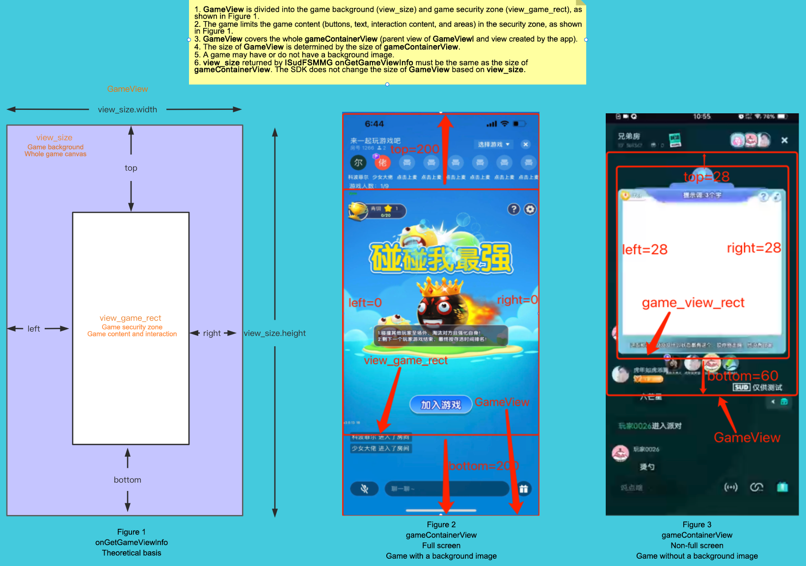
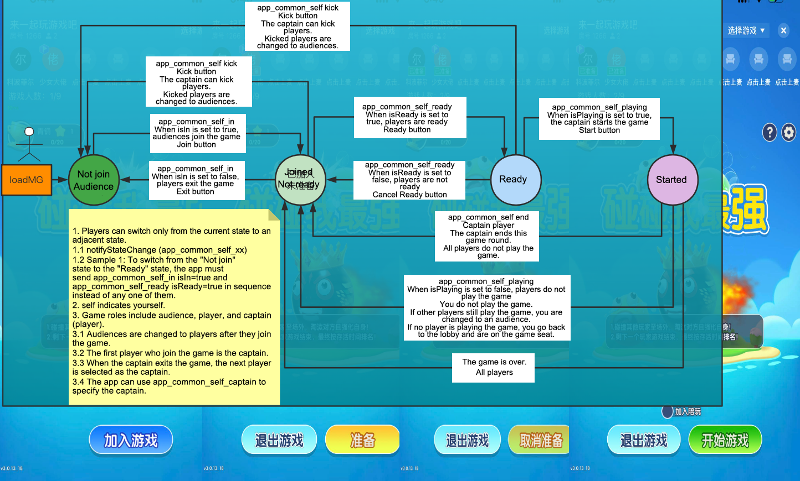

# 


# 1. 快速接入

### 问 1001: 如何快速接入游戏？
1. [快速接入 QuickStart-Android Demo](https://github.com/SudTechnology/hello-sud-plus-android/tree/master/project/QuickStart) ，复用SudMGPWrapper；
2. [快速接入 QuickStart-iOS Demo](https://github.com/SudTechnology/hello-sud-plus-ios/tree/master/project/QuickStart) ，复用SudMGPWrapper；
3. [快速接入 hello-sud-java 服务端 Demo](https://github.com/SudTechnology/hello-sud-java) （访问不了代码仓库，请联系SUD添加github账号）；

### 问 1002: 如何快速定位和解决接入过程中遇到的问题？
1. 请检查接口输入参数是否正确（mgId是64bit类型）；
2. 请查看Android Studio 或 XCode 控制台日志信息，错误码字段result_code、sdk_error_code、retCode数值；
3. 请将问题描述、视频、截图、控制台日志（文件）等信息，发送给我们的技术支持同学，协助您分析和解答；

[错误码 速查列表](https://docs.sud.tech/zh-CN/app/Server/ErrorCode.html)

### 问 1003: HelloSudPlus体验demo下载（展示多业务场景）


# 2. SudMGP接口
### 问 2001: APP调用SudMGP SDK 接口能在非UI/Main线程吗，SudMGP回调APP是在哪个线程？
1. APP调用SudMGP SDK任何接口，都必须在 UI/Main 线程发起调用；
2. SudMGP回调APP，都是在 UI/Main 线程回调；
3. SudMGP负责转线程，简化APP接入逻辑；

### 问 2002: 关于APP调用notifyStateChange接口，listener回调作用吗？
1. notifyStateChange，是APP状态通知给小游戏；
2. ISudListenerNotifyStateChange回调只表示APP状态通知到了小游戏，不表示小游戏执行完成状态通知的逻辑代码（比如：游戏业务逻辑网络请求），接入排查连通性，可以传null；
3. 不要在回调里面写逻辑；
4. 如果想知道调用结果是否失败，可以接 App通用状态操作结果错误码， [mg_common_app_common_self_x_resp](../MGFSM/CommonStateGame.md)；

### 问 2003: 关于游戏回调APP时，ISudFSMStateHandle handle参数？
1. 有ISudFSMStateHandle handle的地方，APP必须调用handle.success，否则会导致C++层回调对象内存泄漏；
2. 游戏向App 获取xx信息，则APP需要handle.success带具体参数；
   ```java
   void onGetGameViewInfo(ISudFSMStateHandle handle, String dataJson);
   void onGetGameCfg(ISudFSMStateHandle handle, String dataJson);
   ```
3. 游戏向App 通知状态信息，则APP只需要handle.success("{}")；
   ```java
   void onExpireCode(ISudFSMStateHandle handle, String dataJson);
   void onGameStateChange(ISudFSMStateHandle handle, String state, String dataJson);
   void onPlayerStateChange(ISudFSMStateHandle handle, String userId, String state, String dataJson);
   ```

### 问 2004: SudMGP是否支持同时运行两个游戏实例？
1. 不支持同时运行两个游戏实例；
2. SudMGP的loadMG和destroyMG必须配对使用；
3. SudMGP负责转线程，简化APP接入；

# 3. 功能实现
### 问 3001: 如何隐藏游戏背景，显示APP自定义背景？
1. 隐藏游戏Loading时的背景：APP调用SudMGP.loadMG之前，设置SudMGP.getCfg().setShowLoadingGameBg(false)；
2. 隐藏游戏场景的背景（游戏大厅）：APP在ISudFSMMG.onGetGameCfg 回调，设置 ui.game_bg.hide=true；
3. SudMGP SDK 最低版本v1.1.46.xx

下载 [SudMGP-Android](https://github.com/SudTechnology/sud-mgp-android/releases)

下载 [SudMGP-iOS](https://github.com/SudTechnology/sud-mgp-ios/releases)

### 问 3002: 如何隐藏游戏橙色Loading进度条，APP自定义Loading进度条？
1. APP调用SudMGP.loadMG之前，设置SudMGP.getCfg().setShowCustomLoading(true);
2. 加载进度通知ISudFSMMG::onGameLoadingProgress(int stage, int retCode, int progress);
3. 加载失败，APP调用重试接口ISudFSTAPP::reloadMG()；
4. SudMGP SDK 最低版本v1.1.52.xx

下载 [SudMGP-Android](https://github.com/SudTechnology/sud-mgp-android/releases)

下载 [SudMGP-iOS](https://github.com/SudTechnology/sud-mgp-ios/releases)

### 问 3003: 游戏View和APP的UI层级关系，游戏安全区（交互操作）？
1. 游戏View，当成是Android 和 iOS 原生View；
2. 游戏View，可以全屏，也可以固定尺寸大小；
3. 游戏View，大小铺满APP给的父View（GameViewContainer）；
4. 游戏通过ISudFSMMG的[onGetGameViewInfo](../API/ISudFSMMG/onGetGameViewInfo.md)回调，获取游戏安全区(交互操作)
   


### 问 3004: 游戏UI元素是否支持隐藏，按钮点击事件是否支持拦截？
1. 支持隐藏游戏UI元素；
   具体配置参考 [onGetGameCfg](../API/ISudFSMMG/onGetGameCfg.md)
2. 支持拦截按钮点击事件；
   具体配置参考 [onGetGameCfg](../API/ISudFSMMG/onGetGameCfg.md)

### 问 3005: 游戏是否支持APP自定义实现加入游戏、开始游戏等逻辑功能？
1. 支持；
2. 支持隐藏游戏UI元素，APP可以实现对应按钮；
   具体配置参考 [onGetGameCfg](../API/ISudFSMMG/onGetGameCfg.md)
3. 支持拦截按钮点击事件；
   具体配置参考 [onGetGameCfg](../API/ISudFSMMG/onGetGameCfg.md)
4. APP可以通过ISudFSTAPP的notifyStateChange接口，实现加入游戏、开始游戏等逻辑功能；
   具体示例：开始游戏按钮

第一步 [onGetGameCfg(IFSMStateHandle handle, String dataJson)](/API/ISudFSMMG/onGetGameCfg.md)

   ```java
   data = {
      "gameMode":1,    // 每个游戏默认模式是1，不填是1
         "ui":{
         "start_btn": {    // 开始游戏按钮
            "custom": true,
            "hide": false
         }
      }
   }
  handle.success(data);
   ```
第二步 [接onGameStateChange mg_common_self_click_start_btn状态回调](../MGFSM/CommonStateGame.md)

第三步 APP判断是否开始游戏，允许开始则调用ISudFSTAPP notifyStateChange接口发送[app_common_self_playing](../APPFST/CommonState.md)状态

### 问 3006: 游戏是否支持多语言本地化，不支持的语言是否支持提供翻译添加？
1. 支持多语言本地化；
2. 支持提供翻译添加，需要联系Sud商务；
3. SudMGP.loadMG的language参数；例如：zh-CN、en-US；

[游戏多语言](../Languages/README.md)

[SudMGP.loadMG的language参数](../API/SudMGP.md)

### 问 3007: APP什么时候可以调用游戏ISudFSTAPP.notifyStateChange接口？
1. APP收到回调ISudFSMMG.onGameStarted后，可以调用ISudFSTAPP.notifyStateChange接口；
2. onGameStarted，表示游戏已开始（游戏长连接建立完成）；

[onGameStarted](../API/ISudFSMMG.md)
3. 用户在游戏的角色状态转化，只能从"当前状态" 转换到 "邻近状态"；



### 问 3008: 每一局游戏如何透传APP自定义参数和自定义查询Key？
1. APP调用ISudFSTAPP.notifyStateChange(state, dataJson)
2. state=app_common_self_playing 和 dataJson.isPlaying=true

   ```json
   {
      "isPlaying": true, // true 开始游戏，false 结束游戏
      "reportGameInfoExtras": "透传参数",        // string类型，Https服务回调report_game_info参数，最大长度1024字节，超过则截断（2022-01-21）
      "reportGameInfoKey": "透传参数key"        // string类型，最大长度64字节，接入方服务端，可以根据这个字段来查询一局游戏的数据
   }
   ```
   [app_common_self_playing](../APPFST/CommonState.md)

# 4. 兼容性解决方案

### 问 4001: 如何解决Android软键盘弹起时，导致游戏View整体上移？
1. AndroidManifest.xml android:windowSoftInputMode="adjustResize"；
2. 在ISudFSMMG回调onGameStarted时，调用setSoftInputMode设置；
   ```java
    public void onGameStarted() {
        getWindow().setSoftInputMode(WindowManager.LayoutParams.SOFT_INPUT_ADJUST_RESIZE | WindowManager.LayoutParams.SOFT_INPUT_STATE_ALWAYS_HIDDEN);
    }
   ```

# 5. 游戏个性化状态

### 问 5001: 狼人杀，如何实现语音版本（天黑请闭眼，几号玩家发言）？
一、APP根据下面两个状态，无脑开启和关闭RTC的推流和拉流（不这么执行，可能会出现作弊情况）

1. mg_common_self_microphone, "isOn": true // 麦克风开关状态 true: 开(APP开启RTC推流)；false: 关(APP关闭RTC推流)
2. mg_common_self_headphone "isOn": true // 耳机（听筒，喇叭）开关状态 true: 开(APP开启RTC拉流)；false: 关(APP关闭RTC拉流)

二、判断APP的麦克风能不能点击，建议条件1和条件2为真才能点击，不能点击给个toast提示：

条件1 mg_common_game_state gameState=2

条件2 mg_common_self_microphone isOn=true（该玩家自己发言了，但是玩家可以选择闭麦）

[麦克风、耳机开关文档](../MGFSM/CommonStateGame.md)

### 问 5002: 你画我猜，如何区分谁作画，谁回答？
1. 选词中状态
2. 作画中状态
3. 显示错误答案状态
4. 显示总积分状态
5. 本次获得积分状态

[你画我猜 状态](../MGFSM/CommonStateGame.md)