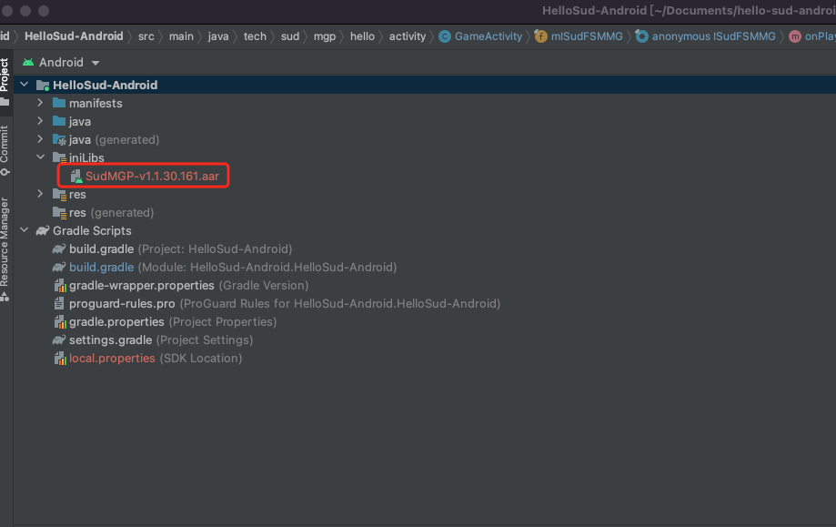

#


## Quick start for Android

1. Contact Sud.Tech to obtain `appId`, `appKey`, `appSecret` for your service.

2. Download [Android SDK SudMGP.aar](https://github.com/SudTechnology/sud-mgp-android/releases) and the demo project [HelloSud-Android.zip](https://github.com/SudTechnology/hello-sud-android/releases).

3. Import the SDK into the project.

    In the following example, Android Studio 4.2, Gradle 6.7.1, and the SudMgpExample-Android project are used, and the programming language is Java:

    - Copy **SudMGP.aar** to the **SudMgpExample-Android/app/libs** directory, as shown in the following figure:

        

        

    - Add the configurations required by the SDK to the **SudMgpExample-Android/app/build.gradle** file.

        ```groovy
        repositories {
            // Load the directory of the game SDK libs.
            flatDir {
                dirs '../app/libs'
            }
        }
        dependencies {
            // Load the game SDK AAR package.
            implementation fileTree(include: ['*.jar', "*.aar"], dir: 'libs')
            // Load OkHttp.
            implementation 'com.squareup.okhttp3:okhttp:4.9.2'
        
            ......
        }
        ```
    
4. Initialize the [SudMGP](./API/SudMGP.md). For details, see "HelloSud-Android".

5. Integrate lifecycle callbacks of the [SudMGP](./API/SudMGP.md) and add the game view to the native layout. For details, see "HelloSud-Android".

6. Load the game using the [SudMGP](API/SudMGP.md). For details, see "HelloSud-Android".

7. Optional: Implement [`ISudFSMMG`](API/ISudFSMMG.md). For details, see "HelloSud-Android".

8. Optional: Implement [`ISudFSTAPP`](API/ISudFSTAPP.md). For details, see "HelloSud-Android".

9. Deinitialize the [SudMGP](API/SudMGP.md). For details, see "HelloSud-Android".

