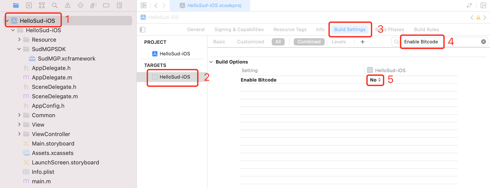
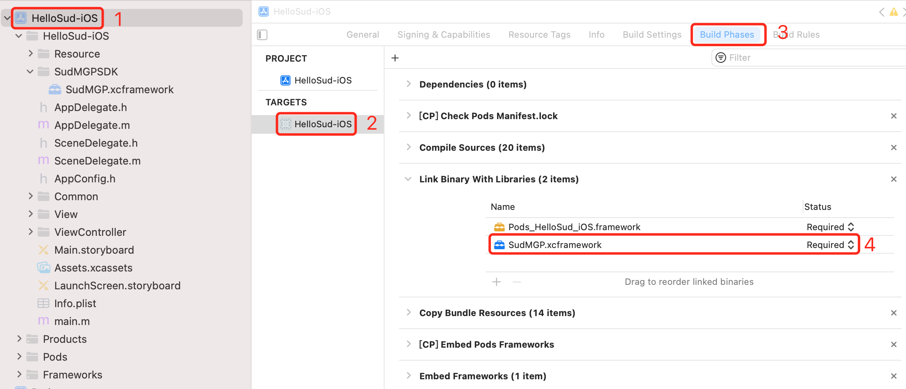
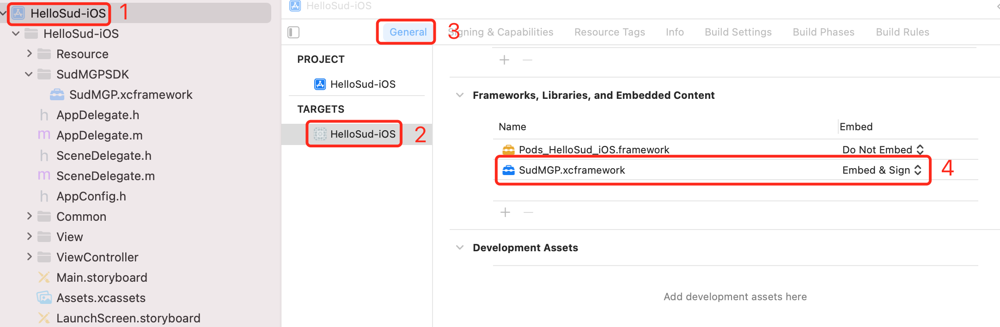

#

## Quick start for iOS

1. Contact Sud.Tech to obtain `appId`, `appKey`, `appSecret` for your service.

2. Download the iOS SDK [SudMGP.xcframework](https://github.com/SudTechnology/sud-mgp-ios/releases) and the demo project [HelloSud-iOS.zip](https://github.com/SudTechnology/hello-sud-ios/releases).

3. Import the SDK into the project.

    In the following example, Xcode 13.0 and the HelloSud-iOS project are used, and the programming language is Objective-C.

    - Copy **SudMGP.xcframework** to the **GameSDK** folder.

    - Open Xcode, select **TARGETS** > **HelloSud-iOS**. Then select **Build Settings** on the right, search for **Enable Bitcode**, and set it to **No**.

    - Select **TARGETS** > **HelloSud-iOS**, and then select **Build Phases**.

    - Drag **SudMGP.xcframework** to **Link Binary With Libraries**.

    - Select **General** and set **SudMGP.xcframework** to **Embed & Sign** in **Frameworks, Libraries, and Embedded Content**.

        The following figures show the operation steps.

        

        

        

4. Initialize the [SudMGP](./API/SudMGP.md). For details, see "HelloSud-iOS".

5. Load the game using the [SudMGP](API/SudMGP.md). For details, see "HelloSud-iOS".

6. Optional: Implement [`ISudFSMMG`](API/ISudFSMMG.md) to respond to the MG finite state machine (FSM). For details, see "HelloSud-iOS".

7. Optional: Implement [`ISudFSTAPP`](API/ISudFSTAPP.md) to send states from the app to the app finite state transducer (FST). For details, see "HelloSud-iOS".

8. Deinitialize the [SudMGP](API/SudMGP.md). For details, see "HelloSud-iOS".

9. API call sequence diagram.
   

