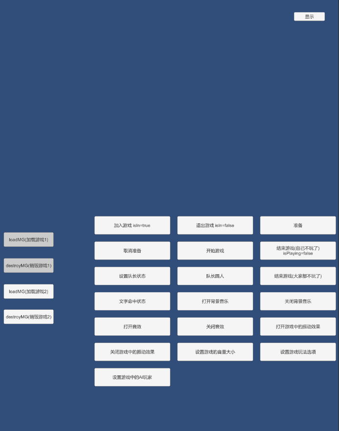
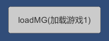
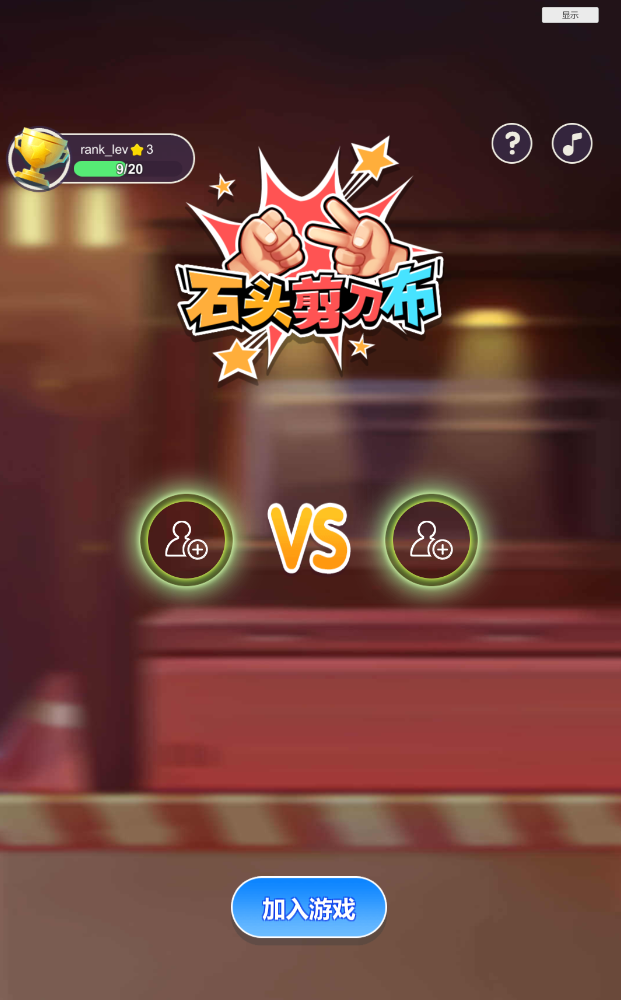
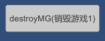
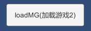
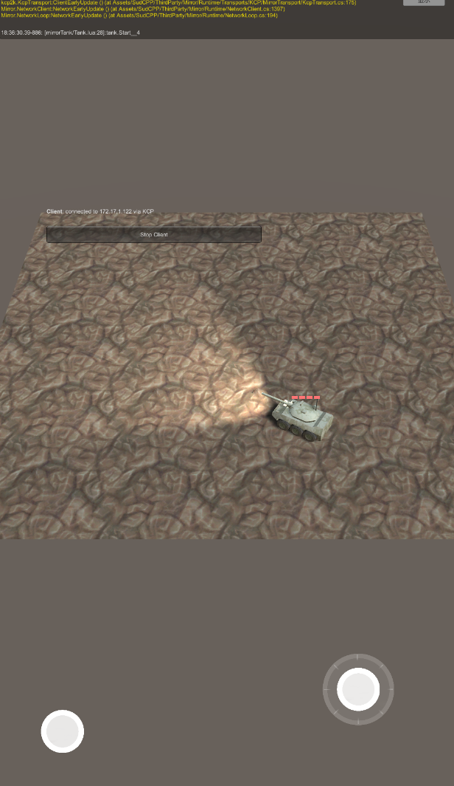
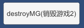
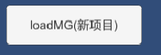

##1- sudcpp-sdk-unity 使用 ##
**1-** 创建一个unity空工程
**2-** 导入[sudcpp-sdk-unity.unitypackage](https://www.baiud.com)
**3-** 打开Assets\SudCPP\MockApp\Scene\MockAppLaunchGame.unity 场景运行
如图:
**4-** 点击运行**石头剪刀布**游戏
如图:
**5-** 点击卸载游戏
**6-** 点击运行**mirror lua demo**游戏
如图:
**7-** 点击卸载游戏

##2- sudcpp-sdk-unity 框架 ##
2个框架分别在:**Assets\SudLuaFrameWork\SudFrameWork** 和 **Assets\SudLuaFrameWork\comframework** 可以根据自己需求现在用其中一个

##3- sudcpp-sdk-unity examples ##
2个示例分别在:**Assets\Examples\1-SudGame** 和 **Assets\Examples\2-MirrorTank**
lua代码在**Output**目录下

##4- 如何创建自己的项目 ##
**1-** 在Assets\NewProject里有一个空项目
**2-** 在Assets\NewProject\Output是输出目录，里面已经放了一个main.lua
**3-** 点击可以运行空项目
**4-** 在Assets\NewProject填充自己项目需要的资源和代码
**5-** 点击调试自己的项目
**6-** 在Editor没问题了，可以出包真机测试
