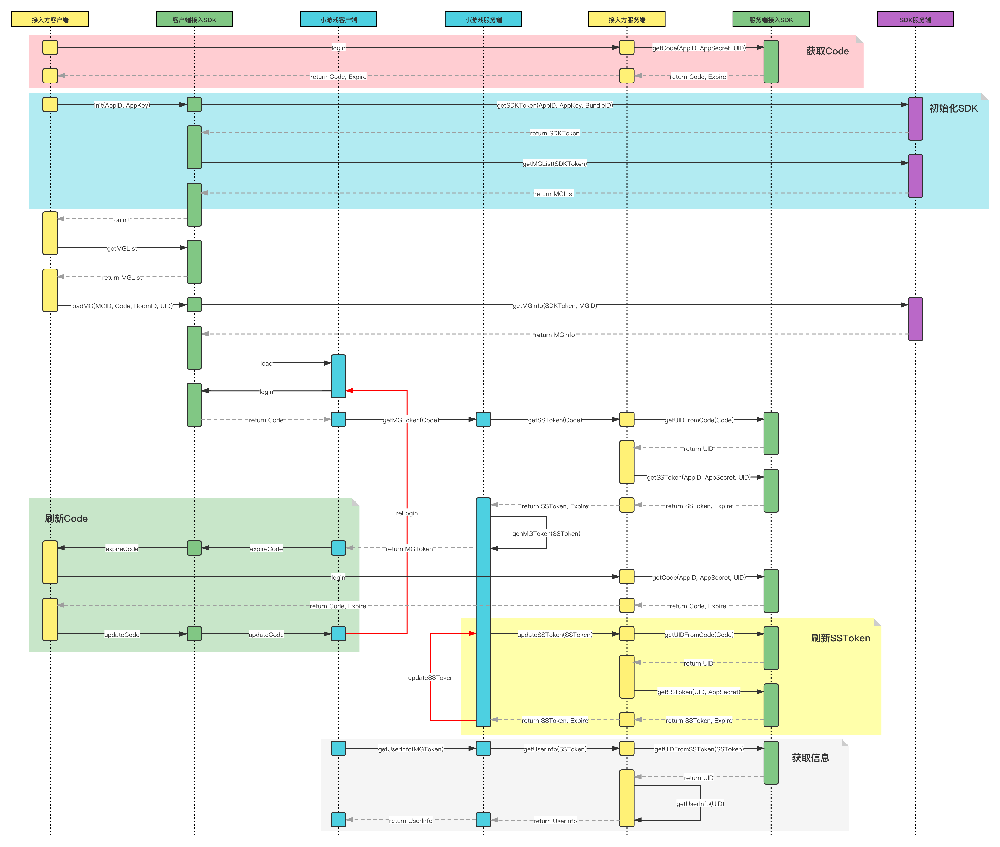

# SUD MGP 互动小游戏接入平台

> Tips
>
> 1. 客户端中，小游戏与App互为有限状态机，逻辑上完全0耦合。
> 2. 业务App可选择性响应小游戏状态机 `ISudFSMMG` 中发出的状态，并在原生中做出对应交互，也可以什么都不做。
> 3. 业务App可选择性向App状态控制器 `ISudFSTAPP` 同步App状态，小游戏会做出相应的反馈和交互调整，也可以什么都不做。
> 4. 由于游戏服务端为分区就近部署，如果业务App上线地区为多个地区时，需为每一个上线地区生成一个App信息。

## 客户端快速接入

- [Android](app/Client/StartUp-Android.md)

- [iOS](app/Client/StartUp-iOS.md)

## 客户端文档

- [文档](app/Client/StartUp.md)

- [更新日志(SudMGP和游戏)](app/Client/ChangeLog.md)
## 客户端SDK下载

- [SudMGP-Android](https://github.com/SudTechnology/sud-mgp-android/releases)
  
- [SudMGP-iOS](https://github.com/SudTechnology/sud-mgp-ios/releases)
  

## 客户端Demo下载

- [QuickStart-Android 全新接入Demo](https://github.com/SudTechnology/hello-sud-plus-android/tree/master/project/QuickStart)

- [QuickStart-iOS 全新接入Demo](https://github.com/SudTechnology/hello-sud-plus-ios/tree/master/project/QuickStart)

- [HelloSud-Android](https://github.com/SudTechnology/hello-sud-android/releases)
  
- [HelloSud-iOS](https://github.com/SudTechnology/hello-sud-ios/releases)

- [HelloSudPlus-Android 展示多业务场景](https://github.com/SudTechnology/hello-sud-plus-android/tree/master)

- [HelloSudPlus-iOS 展示多业务场景](https://github.com/SudTechnology/hello-sud-plus-ios/tree/master)

## FAQ
- [FAQ](app/Client/FAQ/README.md)

## 游戏多语言
- [游戏多语言](app/Client/Languages/README.md) loadMG language参数

> Tips
>
> 1. 服务端中，小游戏服务与业务服务的鉴权和数据交换，建议通过标准JWT进行，也可以通过任何自定义的方式进行。
> 2. 通过 `SudMGPAuth` 实现标准JWT的方式，业务服务可保持原有客户端登陆鉴权逻辑，并将登陆状态穿透至服务端，使得小游戏服务与业务服务的鉴权和数据交换都是基于用户登陆行为的，以此最大限度保证业务数据安全。同时业务服务无需额外的持久化服务处理复杂的映射关系（如业务真实UID和提供给SudMGP的虚拟UID的对应关系）问题，理论上只需要单点无存储服务即可，信息实际安全存储于JWT令牌中。
> 3. 自定义方式，业务方可自行选择任意长短令牌生成和交换方式，无需使用 `SudMGPAuth` 。

## 服务端快速接入

- [Java](app/Server/StartUp-Java.md)

- [Go](app/Server/StartUp-Go.md)

- [Node](app/Server/StartUp-Node.md)

## 服务端文档

- [文档](app/Server/StartUp.md)
- [更新日志](app/Server/Server_Change_Log.md)

## 服务端SDK下载

- [Java v1.0.4](https://github.com/SudTechnology/sud-mgp-auth-java/releases)

- [Go v1.0.2](https://github.com/SudTechnology/sud-mgp-auth-go/releases)

- [Node v1.0.1](https://github.com/SudTechnology/sud-mgp-auth-node/releases)

## 服务端Demo下载

- [Java v1.0.0](https://github.com/SudTechnology/hello-sud-java/releases)

- [Go v1.0.0](https://github.com/SudTechnology/hello-sud-go/releases)

- [Node v1.0.1](https://github.com/SudTechnology/hello-sud-node/releases)
