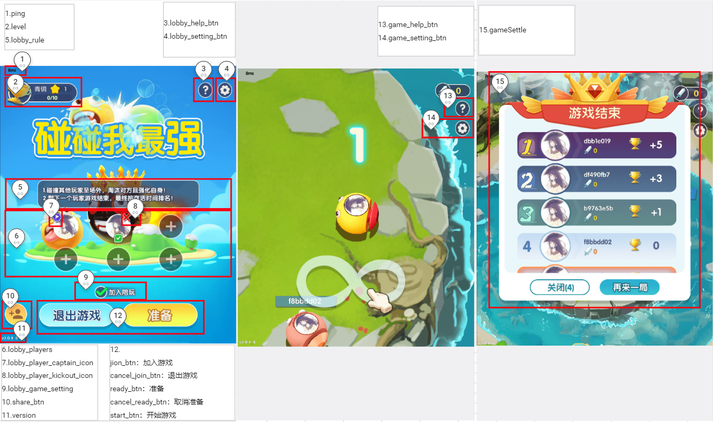

#


```txt
/**
 * 获取游戏Config
 * @param handle
 * @param dataJson {}
 * 最低版本：v1.1.30.xx
 */
void onGetGameCfg(ISudFSMStateHandle handle, String dataJson);
```

## 示例 
```txt
handle.success(dataJsonResp);

dataJsonResp = {
    "gameMode":1,	// 每个游戏默认模式是1，不填是1
	"ui":{
		"gameSettle":{
			"hide":false
		},
		"ping":{
			"hide":false
		},
		"version":{
			"hide":false
		}
	}
}
```

### 标注


### 参数

|参数名|必选|类型|说明|
|:----    |:---|:----- |-----   |
|gameMode	|否	|int	|游戏模式（每个游戏默认模式是1，不填是1）|
|gameCPU	|否	|int	|游戏CPU（值为0和1；0：CPU正常功耗，1：CPU低功耗；默认是0，CPU正常功耗）|
|gameSoundControl	|否	|int	|游戏中声音的播放是否被app层接管（值为0和1；0：游戏播放声音，1：app层播放声音，游戏中不播放任何声音；默认是0）|
|gameSoundVolume	|否	|int	|游戏中音量的大小（值为0到100；默认是100）|
|ui	|否	|json	|对ui界面的配置，可定制ui界面的显示与不显示|
|ui.gameSettle  |否  |json |结算界面   |
|ui.gameSettle.hide  |否  |bool |是否隐藏结算界面（false: 显示； true: 隐藏，默认为 false）   |
|ui.ping  |否  |json |界面中的ping值  |
|ui.ping.hide  |否  |bool |是否隐藏ping值（false: 显示；true: 隐藏，默认为false）  |
|ui.version  |否  |json |界面中的版本号信息值   |
|ui.version.hide  |否  |bool |是否隐藏版本号信息（false: 显示； true: 隐藏，默认为false）   |
|ui.level  |否  |json |大厅中的段位信息   |
|ui.level.hide  |否  |bool |是否隐藏段位信息（false: 显示； true: 隐藏，默认为false）   |
|ui.lobby_setting_btn  |否  |json |大厅的『设置/音效』按钮   |
|ui.lobby_setting_btn.hide  |否  |bool |是否隐藏大厅的『设置/音效』按钮（false: 显示； true: 隐藏，默认为false）   |
|ui.lobby_help_btn  |否  |json |大厅的『帮助』按钮   |
|ui.lobby_help_btn.hide  |否  |bool |是否隐藏大厅的『帮助』按钮（false: 显示； true: 隐藏，默认为false）   |
|ui.lobby_players  |否  |json |大厅游戏位   |
|ui.lobby_players.custom  |否  |bool |点击大厅游戏位加入游戏（false: 游戏处理逻辑； true: 游戏只通知app按钮点击事件，不处理；默认为false）   |
|ui.lobby_players.hide  |否  |bool |是否隐藏大厅游戏位（false: 显示； true: 隐藏，默认为false；teenpatti和德州扑克暂不支持隐藏）   |
|ui.lobby_player_captain_icon  |否  |json |大厅游戏位上队长标识   |
|ui.lobby_player_captain_icon.hide  |否  |bool |是否隐藏大厅游戏位上队长标识（false: 显示； true: 隐藏，默认为false）   |
|ui.lobby_player_kickout_icon  |否  |json |大厅游戏位上『踢人』按钮   |
|ui.lobby_player_kickout_icon.hide  |否  |bool |是否隐藏大厅游戏位上『踢人』按钮（false: 显示； true: 隐藏，默认为false）   |
|ui.lobby_rule  |否  |json |大厅的玩法规则描述文字   |
|ui.lobby_rule.hide  |否  |bool |是否隐藏大厅的玩法规则描述文字（false: 显示； true: 隐藏，默认为false）   |
|ui.lobby_game_setting  |否  |json |大厅的玩法设置   |
|ui.lobby_game_setting.hide  |否  |bool |是否隐藏大厅的玩法设置（false: 显示； true: 隐藏，默认为false）   |
|ui.join_btn  |否  |json |『加入游戏』按钮   |
|ui.join_btn.custom  |否  |bool |『加入游戏』按钮抛事件（false: 游戏处理逻辑； true: 游戏只通知app按钮点击事件，不处理；默认为false）   |
|ui.join_btn.hide  |否  |bool |是否隐藏『加入游戏』按钮（false: 显示； true: 隐藏，默认为false）   |
|ui.cancel_join_btn  |否  |json |『退出游戏』按钮   |
|ui.cancel_join_btn.custom  |否  |bool |『退出游戏』按钮抛事件（false: 游戏处理逻辑； true: 游戏只通知app按钮点击事件，不处理；默认为false）   |
|ui.cancel_join_btn.hide  |否  |bool |是否隐藏『退出游戏』按钮（false: 显示； true: 隐藏，默认为false）   |
|ui.ready_btn  |否  |json |『准备』按钮   |
|ui.ready_btn.custom  |否  |bool |『准备』按钮抛事件（false: 游戏处理逻辑； true: 游戏只通知app按钮点击事件，不处理；默认为false）   |
|ui.ready_btn.hide  |否  |bool |是否隐藏『准备』按钮（false: 显示； true: 隐藏，默认为false）   |
|ui.cancel_ready_btn  |否  |json |『取消准备』按钮   |
|ui.cancel_ready_btn.custom  |否  |bool |『取消准备』按钮抛事件（false: 游戏处理逻辑； true: 游戏只通知app按钮点击事件，不处理；默认为false）   |
|ui.cancel_ready_btn.hide  |否  |bool |是否隐藏『取消准备』按钮（false: 显示； true: 隐藏，默认为false）   |
|ui.start_btn  |否  |json |『开始游戏』按钮   |
|ui.start_btn.custom  |否  |bool |『开始游戏』按钮抛事件（false: 游戏处理逻辑； true: 游戏只通知app按钮点击事件，不处理；默认为false）   |
|ui.start_btn.hide  |否  |bool |是否隐藏『开始游戏』按钮（false: 显示； true: 隐藏，默认为false）   |
|ui.share_btn  |否  |json |『分享』按钮   |
|ui.share_btn.custom  |否  |bool |『分享』按钮抛事件（false: 游戏处理逻辑； true: 游戏只通知app按钮点击事件，不处理；默认为false）   |
|ui.share_btn.hide  |否  |bool |是否隐藏『分享』按钮（false: 显示； true: 隐藏，默认为true）   |
|ui.game_setting_btn  |否  |json |战斗场景中的『设置/音效』按钮   |
|ui.game_setting_btn.hide  |否  |bool |是否隐藏战斗场景中的『设置/音效』按钮（false: 显示； true: 隐藏，默认为false）   |
|ui.game_help_btn  |否  |json |战斗场景中的『帮助』按钮   |
|ui.game_help_btn.hide  |否  |bool |是否隐藏战斗场景中的『帮助』按钮（false: 显示； true: 隐藏，默认为false）   |
|ui.game_settle_close_btn  |否  |json |结算界面中的『关闭』按钮   |
|ui.game_settle_close_btn.hide  |否  |bool |是否隐藏结算界面中的『关闭』按钮（false: 显示； true: 隐藏，默认为true）   |
|ui.game_settle_close_btn.custom  |否  |bool |结算界面中的『关闭』按钮抛事件（false: 关闭结算界面返回大厅； true: 游戏通知app按钮点击事件，并关闭结算界面返回大厅；默认为false）   |
|ui.game_settle_again_btn  |否  |json |结算界面中的『再来一局』按钮   |
|ui.game_settle_again_btn.hide  |否  |bool |是否隐藏结算界面中的『再来一局』按钮（false: 显示； true: 隐藏，默认为true）   |
|ui.game_settle_again_btn.custom  |否  |bool |结算界面中的『再来一局』按钮抛事件（false: 关闭结算界面返回大厅并将玩家设置为准备状态； true: 游戏通知app按钮点击事件，并关闭结算界面返回大厅（不将玩家设置为准备状态）；默认为false）   |
|ui.game_bg.hide  |否  |bool |是否隐藏背景图，包括大厅和战斗（false: 显示； true: 隐藏，默认为false）   |
|ui.block_change_seat  |否  |json |自定义阻止换座位（目前仅支持飞行棋）  |
|ui.block_change_seat.custom  |否  |bool |自定义阻止换座位（false: 可以换座位； true: 不可以换座位；默认为false）   |
|ui.game_setting_select_pnl  |否  |json |大厅中的玩法选择设置面板   |
|ui.game_setting_select_pnl.hide  |否  |bool |是否隐藏大厅中的玩法选择设置面板（false: 显示； true: 隐藏，默认为false）   |
|ui.game_managed_image  |否  |json |游戏中的托管图标   |
|ui.game_managed_image.hide  |否  |bool |是否隐藏游戏中的托管图标（false: 显示； true: 隐藏，默认为false）   |
|ui.game_table_image  |否  |json |游戏中牌桌背景图  （注：只对某些带牌桌类游戏有作用） |
|ui.game_table_image.hide  |否  |bool |是否隐藏游戏牌桌背景图（false: 显示； true: 隐藏，默认为false）   |
|ui.game_countdown_time  |否  |json |游戏中游戏倒计时显示  （注：现在只针对umo生效） |
|ui.game_countdown_time.hide  |否  |bool |是否隐藏游戏中游戏倒计时显示（false: 显示； true: 隐藏，默认为false）   |
|ui.game_selected_tips  |否  |json |游戏中所选择的玩法提示文字  （注：现在只针对ludo生效） |
|ui.game_selected_tips.hide  |否  |bool |是否隐藏游戏中所选择的玩法提示文字显示（false: 显示； true: 隐藏，默认为false）   |
|ui.nft_avatar  |否  |json |游戏中的NFT头像   |
|ui.nft_avatar.hide  |否  |bool |是否隐藏游戏中NFT头像的显示（false: 显示； true: 隐藏，默认为ture）   |
|ui.game_opening  |否  |json |游戏开场动画   |
|ui.game_opening.hide  |否  |bool |是否隐藏游戏中的开场动画（false: 显示； true: 隐藏，默认为true）   |
|ui.game_mvp  |否  |json |游戏结算前的mvp动画   |
|ui.game_mvp.hide  |否  |bool |是否隐藏游戏结算前的mvp动画（false: 显示； true: 隐藏，默认为ture）   |
|ui.umo_icon  |否  |json |游戏中动画和头像右上角的UMO图标   |
|ui.umo_icon.hide  |否  |bool |是否隐藏游戏中动画和头像右上角的UMO图标并改为UNO（false: 不隐藏，依然显示UMO； true: 隐藏，改为显示UNO，默认为false）   |
|ui.logo  |否  |json |大厅中的logo   |
|ui.logo.hide  |否  |bool |是否隐藏大厅中的logo（false: 不隐藏； true: 隐藏，默认为false）   |
|ui.game_players  |否  |json |游戏中的游戏位   |
|ui.game_players.hide  |否  |bool |是否隐藏游戏中的游戏位（false: 不隐藏； true: 隐藏，默认为false，暂时只支持你画我猜）   |


### 返回示例
```txt
{
    "gameMode":1,
	"gameCPU": 0,
	"gameSoundControl": 0,
	"gameSoundVolume": 100,
    "ui":{
        "gameSettle":{
            "hide":false
        },
        "ping":{
            "hide":false
        },
        "version":{
            "hide":false
        },
        "level":{
            "hide":false
        },
        "lobby_setting_btn":{
            "hide":false
        },
        "lobby_help_btn":{
            "hide":false
        },
        "lobby_players":{
			"custom": false,
            "hide":true
        },
        "lobby_player_captain_icon":{
            "hide":false
        },
        "lobby_player_kickout_icon":{
            "hide":false
        },
        "lobby_rule":{
            "hide":false
        },
        "lobby_game_setting":{
            "hide":false
        },
        "join_btn":{
            "custom":false,
            "hide":false
        },
        "cancel_join_btn":{
            "custom":false,
            "hide":false
        },
        "ready_btn":{
            "custom":false,
            "hide":false
        },
        "cancel_ready_btn":{
            "custom":false,
            "hide":false
        },
        "start_btn":{
            "custom":false,
            "hide":false
        },
        "share_btn":{
			"custom":false,
            "hide":true
        },
        "game_setting_btn":{
            "hide":false
        },
        "game_help_btn":{
            "hide":false
        }
        "game_settle_close_btn": {
            "hide": false,
            "custom": false
        },
        "game_settle_again_btn": {
            "hide": false,
            "custom": false
        },
        "game_bg": {
            "hide": false
        },
		"block_change_seat": {
			"custom": false
		},
		"game_setting_select_pnl": {
			"hide": false
		},
		"game_managed_image": {
			"hide": false
		},
        "game_table_iamge": {
            "hide": false
        },
        "game_countdown_time": {
            "hide": false
        },
        "game_selected_tips": {
            "hide": false
        },
        "nft_avatar": {
            "hide": true
        },
        "game_opening": {
            "hide": true
        },
        "game_mvp": {
            "hide": true
        },
        "umo_icon": {
            "hide": false
        },
        "logo": {
            "hide": false
        },
        "game_players": {
            "hide": false
        }
    }
}
```
