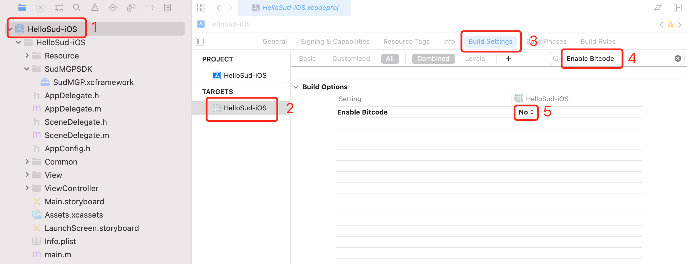

#

## iOS快速开始

1. 需要联系Sud.Tech为业务分配 `appId`、 `appKey`、 `appSecret`

2. 下载 iOS SDK [SudMGP.xcframework](https://github.com/SudTechnology/sud-mgp-ios/releases) 和 Demo工程 [HelloSud-iOS.zip](https://github.com/SudTechnology/hello-sud-ios/releases)

3. 在工程中引入SDK：

    以Xcode 13.0，编程语言Objective-C，目标工程HelloSud-iOS为例：

    - 将 `SudMGP.xcframework` 拷贝到GameSDK文件夹中

    - 打开Xcode，选择TARGETS，选中HelloSud-iOS，选中Build Settings，搜索Enable Bitcode，配置为No

    - 在TARGETS中，选中HelloSud-iOS，选择 Build Phases

    - 将 `SudMGP.xcframework` 拖到 Link Binary With Libraries

    - 选择 General，在 Frameworks, Libraries, and Embedded Content 中，将 `SudMGP.xcframework` 设置为 Embed & Sign

        如下图：

        

        

        

4. 初始化 [SudMGP](./API/SudMGP.md) ，具体可参考HelloSud-iOS

5. 通过 [SudMGP](API/SudMGP.md) 加载小游戏，具体可参考HelloSud-iOS

6. 可选：实现 [ISudFSMMG](API/ISudFSMMG.md) 响应MG状态机，具体可参考HelloSud-iOS

7. 可选：实现 [ISudFSTAPP](API/ISudFSTAPP.md) 将App状态发送到App状态控制器，具体可参考HelloSud-iOS

8.  反初始化 [SudMGP](API/SudMGP.md) ，具体可参考HelloSud-iOS

9. API调用时序图

   
