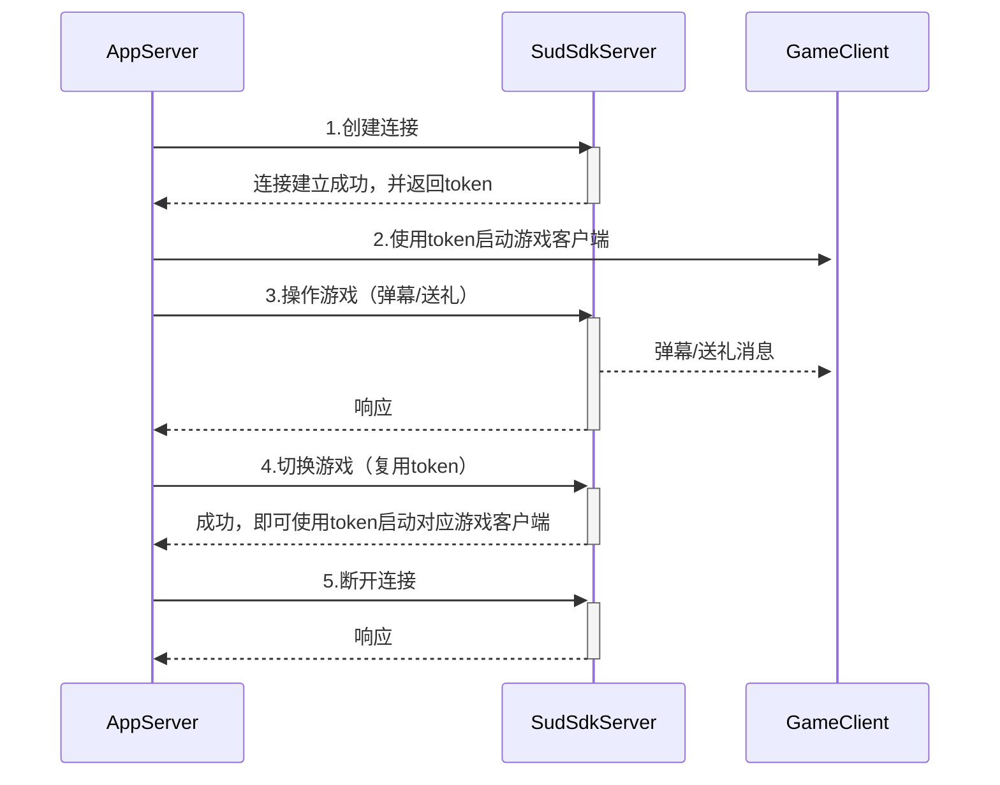

#

## 弹幕游戏服务API

- [弹幕服务创建连接](BulletConnect.md)
- [弹幕服务断开连接](BulletDisconnect.md)
- [弹幕服务切换游戏](BulletChangeGame.md)
- [弹幕服务操作游戏](BulletOperate.md)

## 弹幕游戏接入时序图

```mermaid
sequenceDiagram
	participant app as AppServer
	participant sud as SudSdkServer
	participant game as GameClient
	
    app ->> sud: 1.创建连接
    activate sud
    sud -->> app: 连接建立成功，并返回token
    deactivate sud

    app ->> +game: 2.使用token启动游戏客户端

    app ->> sud: 3.操作游戏（弹幕/送礼）
    activate sud
    sud -->> game: 弹幕/送礼消息
    sud -->> app: 响应
    deactivate sud

    app ->> +sud: 4.切换游戏（复用token）
    sud -->> -app: 成功，即可使用token启动对应游戏客户端

    app ->> +sud: 5.断开连接
    sud -->> -app: 响应
```